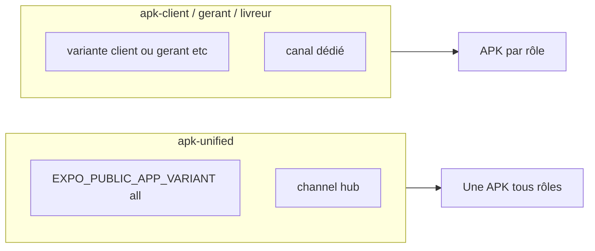

# Vérification APK unifiée (Husko By Night)

Procédure pour confirmer qu’une APK installée correspond au profil EAS **`apk-unified`** (variante **all**, canal OTA **`hub`**). Référence code : [`src/components/OtaUpdateSection.tsx`](../src/components/OtaUpdateSection.tsx), profil [`eas.json`](../eas.json) (`apk-unified`).

**Référence versionCode :** après un `npm run build:apk:unified` réussi, la valeur attendue pour **Build natif (APK / store)** sur l’appareil est celle de `expo.android.versionCode` dans [`app.json`](../app.json) (bump automatique EAS à chaque build). Elle augmente à chaque nouveau build ; ne pas se fier à un numéro figé dans une ancienne doc.

## Ce que tu installes

| Élément | Valeur |
|--------|--------|
| Profil EAS | `apk-unified` |
| Rôles dans la même APK | gérant + client + livreur (`EXPO_PUBLIC_APP_VARIANT=all`) |
| Canal EAS Update | `hub` |
| Fichier local (après téléchargement) | `dist/Husko-ByNight-unified-latest.apk` |

## Contrôle sur le téléphone

1. Installe l’APK unifiée (QR Expo, lien de build, ou fichier `dist/Husko-ByNight-unified-latest.apk`).
2. Ouvre **Réglages** (client, gérant, livreur ou assistant — la section OTA est identique partout).
3. Dans **« Mise à jour de l’app (OTA) »**, vérifie :

| Champ | Valeur attendue (APK unifiée récente) |
|--------|--------------------------------------|
| Pastille mode | **Build installé** (pas « développement (Metro) ») |
| **Variante app (extra)** | **`all`** |
| **Canal EAS Update** | **`hub`** |
| **Build natif (APK / store)** | **Identique** au `versionCode` dans `app.json` après le dernier build EAS (ex. **49** si le dépôt est aligné sur le dernier build unifié) |
| Dernier bundle OTA | Peut être vide ou « bundle embarqué » tant qu’aucun `eas update` n’a été poussé sur `hub` |

Si **variante ≠ all** ou **canal ≠ hub**, ce n’est pas l’APK du profil `apk-unified` (ou une ancienne installation).

## Si l’interface semble ancienne

En release, le JS vient du bundle embarqué au **`eas build`** ou d’une mise à jour **OTA** sur le **même canal** que celui affiché. Voir les indications dans l’écran OTA ou [`OtaUpdateSection.tsx`](../src/components/OtaUpdateSection.tsx) (lignes ~82–93).

## Commandes (déjà dans le projet)

| Action | Commande |
|--------|----------|
| Nouvelle APK unifiée | `npm run build:apk:unified` |
| Télécharger la dernière unifiée depuis EAS | `npm run apk:get:unified` ou `npm run apk:download:unified` |
| APK **mono-rôle** (ex. client uniquement) | `npm run build:apk:client` — autre profil et autre canal ; ne pas confondre avec l’unifiée |

Scripts définis dans [`package.json`](../package.json).

## Fichiers réglages (section OTA)

- [`app/client/reglages.tsx`](../app/client/reglages.tsx)
- [`app/gerant/reglages.tsx`](../app/gerant/reglages.tsx)
- [`app/livreur/reglages.tsx`](../app/livreur/reglages.tsx)
- [`app/assistant/reglages.tsx`](../app/assistant/reglages.tsx)
